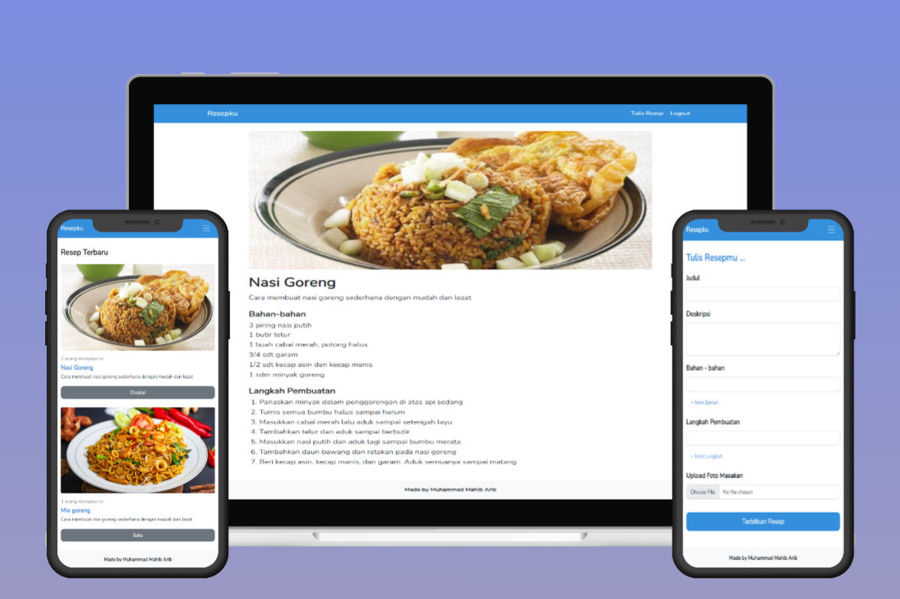

# RESEPKU

Website untuk berbagi resep makanan menggunakan Laravel 7



## Fitur yang tersedia

-   Authentikasi user
-   Membuat postingan resep masakan
-   Like postingan resep masakan

## Installation project

Cara install project menggunakan terminal/CMD. Pastikan direktori folder berada di C:\xampp\htdocs. Dan buat database pada phpMyAdmin dengan nama foodrecipes.

```bash
  git clone https://github.com/Mahib22/food-recipes.git
  cd foodrecipes
  composer install
  cp .env.example .env
  npm install
  npm run dev
  php artisan migrate
  php artisan serve
```
